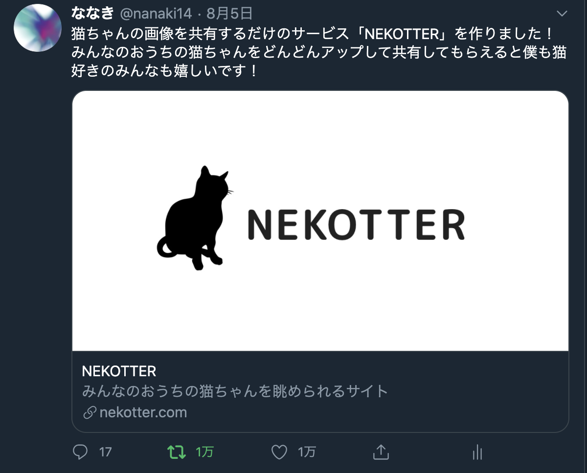
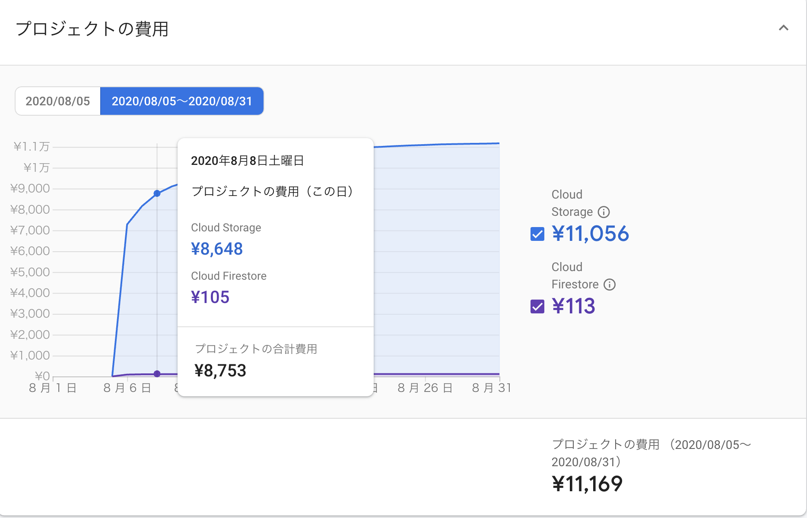
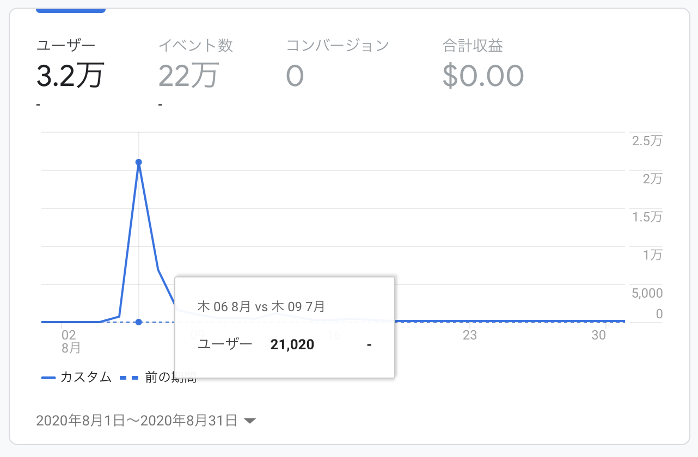

こんにちわ、ななきです。

8月から環境が変わったこともあり、[なべさん](https://nabettu.com/088bf78cc76b4d7f9fb3115550f1067a)の真似をして何をやったか残していこうかなと思って久々の更新頑張ってます。

そんなわけで毎月更新できるように頑張るのでよろしくお願いします🐈

## フリーランスになりました

7月末に1年ほど勤めた[株式会社MAZIN](https://www.mazin.tech/)を退職してフリーランスになりました。

もともと2019年の2月から開業届を出して副業という形で仕事はしてきていたのですが、退職を機に頑張ってみようと思いフリーランスの道を選びました。

もともとスタートアップの立ち上げをサポートできるようなスピード感のある開発がしたいとか、一緒に仕事をしたいと言ってくれてた人達と楽しい受託やりたいみたいな気持ちが強くあったので、ある程度満足したら就職する可能性もあります。

もちろん法人化する可能性もあります。

かなり気分屋なのでこの辺は時間が経ってみないとわからないかなと思ってます。

## 個人開発でNEKOTTERを作りました

svelteとfirebaseで軽い素振りのつもりで作ったのですが、思いの外反響がありびびり散らかしてました。

開発当初はsvelteで書いていたのですが、rollupでの開発経験がなくexport周りでハマったりsvelteのrouterのバグを踏んだりしてコードを書くことに集中できなかったのでリリース後一週間ほどでReactにリプレイスしてます。

また、現在アップデートなど色々と手が回ってないですが9月半ばで仕事がひと段落着く予定のため、一度大きくアップデートをかけたいなと思ってます。

それと初日と2日目のアクセス数がすごかったのもあり、まわりのエンジニアからはfirebaseの料金の心配をしていただいていたのでここで公開しておこうと思います笑

firebaseの料金はほとんどstrageの帯域幅の金額でした、初日で7000円を超えて緩やかに11000円を超えた感じですね。

バズる予定じゃなかったので初日で7000円を超えた時はもやし生活を覚悟しました…w

GAの方は瞬間最大風速で21020人のアクセスがありました。

その後も定期的にアクセスが伸びる瞬間があるようで、ありがたいと同時にちゃんとメンテナンスしなきゃという気持ちです。(がんばります……)

NEKOTTERとは別に今友人とサービス作ってるので今月出していければなと思ってます。

## その他のお話

・実装のお手伝いをしていたsorouが公開されました([https://sorou-tyo.com/](https://sorou-tyo.com/))

・ブログ更新しなさすぎて久々にコードみたら酷かったので書き直したい(ツイッターカード展開できないし)

・年内は体調管理しつつ仕事して、勉強や個人制作に当てていければと思ってます(実行できるのかわからない)

・8月は漫画飼いまくってたんですけど、[少年の痕](https://magcomi.com/episode/10834108156766387837)って漫画が面白かったです。

・5月に猫飼いました

・その後猫拾いました

それでは9月もよろしくお願いします。